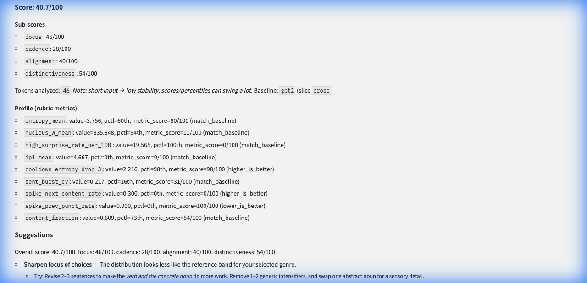
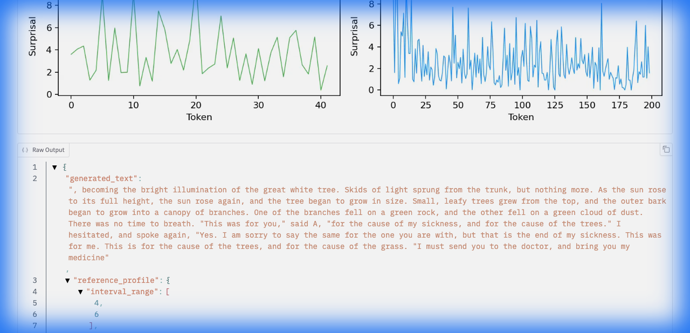
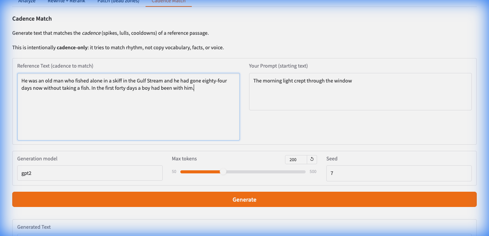

# Horace — Measure & Generate Literary Cadence

Horace measures the **cadence** of writing—the rhythm of surprise, the pattern of spikes and lulls—and uses it to generate text with intentional literary style.

## Score Any Text

Paste any writing and get a **score (0–100)**, detailed breakdown, and specific suggestions:



## Match Any Cadence

Generate text that matches the *rhythm* of a reference passage—without copying its content:



## Quickstart

```bash
make setup
make run-ui    # http://127.0.0.1:7861
```



---

## Features

### Horace Studio (Local UI)
Paste writing → get a **score**, **profile**, **suggestions**, and optional **rewrites**.

```bash
python tools/studio_ui.py --port 7861
```

Tabs:
- **Analyze** — Score + percentile breakdown + LLM critique
- **Rewrite + Rerank** — Generate candidates, rank by Horace metrics
- **Patch (dead zones)** — Target flat spans with MeaningLock protection
- **Cadence Match** — Match the rhythm of reference text (new!)

### Cadence Sampler
Token-aware generation with **Base → Spike → Cooldown** phases:

```python
from tools.sampler import CadenceSampler, PoetryConfig

config = PoetryConfig(interval_range=(10, 18), spike_temperature=1.3)
sampler = CadenceSampler(backend, config)
text = sampler.generate("The morning light", max_new_tokens=200)
```

### Analysis Pipeline
Extract per-token metrics from any causal LM:

```bash
python tools/analyze.py run --config configs/gpt2_mlx.json
```

Captures: surprisal, entropy, rank, nucleus width, cadence metrics (IPI, MASD, ACF).

---

## Install

Requires Python 3.9+.

```bash
# Apple Silicon (recommended)
pip install mlx mlx-lm

# Or HuggingFace/PyTorch fallback
pip install -r requirements.txt
```

---

## API

```bash
python -m tools.studio_api --port 8000
```

Docs:
- Human: `GET /api`
- OpenAPI: `GET /docs` (or `GET /openapi.json`)

Endpoints:
- `POST /analyze` — Score text
- `POST /rewrite` — Generate + rank rewrites  
- `POST /patch/suggest` — Find dead zones
- `POST /patch/span` — Patch a span
- `POST /cadence-match` — Generate matching reference cadence

## Runtime Safety

So what: Horace can fetch remote web content and load HF models at runtime, so the defaults now block risky inputs unless explicitly allowed.

- URL scoring only accepts public `http`/`https` targets (no `file://`, localhost, or private-network hosts).
- Remote model IDs must be allowlisted or pinned as `<repo>@<revision>`.
- Remote model code loading (`trust_remote_code`) is disabled by default.

```bash
# Optional: allow remote model code only for reviewed models
export HORACE_ALLOW_REMOTE_CODE=1

# Optional: extend default allowlist for unpinned remote model IDs
export HORACE_MODEL_ID_ALLOWLIST="org/model-a,org/model-b"
```

---

## Reports & Documentation

| Link | Description |
|------|-------------|
| [Final Report (HTML)](reports/final/report.html) | Self-contained book with figures |
| [Studio Docs](docs/studio.md) | Detailed Studio documentation |
| [Benchmark](docs/benchmark.md) | Eval dataset + held-out metrics |
| [Data & Corpora](docs/data.md) | How corpora/splits/baselines are built |
| [Reward Design](docs/reward.md) | GRPO reward plan |

---

## Corpora (data)

So what: Horace’s baselines, evals, and (optional) training runs are driven by **corpus snapshots** — windowed text datasets written under `data/corpora/` (gitignored).

<details>
<summary>Build a corpus snapshot / add a new source</summary>

- Curated public-domain prose (Standard Ebooks): `make build-standardebooks-corpus` (or `make modal-build-standardebooks-corpus`)
- Modern prose via RSS/Atom: add feeds in `configs/rss_feeds_v1.json`, then `make build-rss-corpus` (or `make modal-build-rss-corpus`)
- Gutenberg at scale: `make download-gutenberg-raw`, then sample windows with `make sample-windows-great` / `make sample-windows-other`

More detail (splits, leakage rules, mixing sources): `docs/data.md`.
</details>

---

## Key Concepts

**Cadence** — The pattern of surprise in text. Great writing has purposeful *spikes* (unexpected words) followed by *cooldowns* (resolution).

**Dead Zones** — Flat spans with low texture, often bureaucratic or repetitive.

**MeaningLock** — Semantic guard ensuring rewrites preserve numbers, proper nouns, and core meaning.

**Spike Rate** — High-surprise tokens per 100 tokens. Literary text: ~8%. AI slop: ~2%.

---

## Project Structure

```
tools/
├── studio_ui.py      # Gradio UI
├── studio_api.py     # FastAPI endpoints
├── sampler.py        # CadenceSampler
├── analyze.py        # Token extraction pipeline
└── studio/
    ├── cadence_profile.py   # Profile extraction
    ├── write_like.py        # Cadence Match generation
    ├── spike_patterns.py    # Spike analysis
    ├── span_patcher.py      # Dead zone patching
    └── meaning_lock.py      # Semantic guard
```

---

## GRPO Training

Train a cadence-aware model using GRPO:

```bash
# MLX adapter (fast, base model frozen)
python tools/grpo_train.py --config configs/grpo_default.json

# Full HF training (slower, trains weights)
python tools/grpo_full_train.py --config configs/grpo_default.json
```

---

## Why

> Great writing isn't random or safe—it rides a rhythm of focused choices punctuated by turns.

Horace measures those patterns and makes models follow them.
