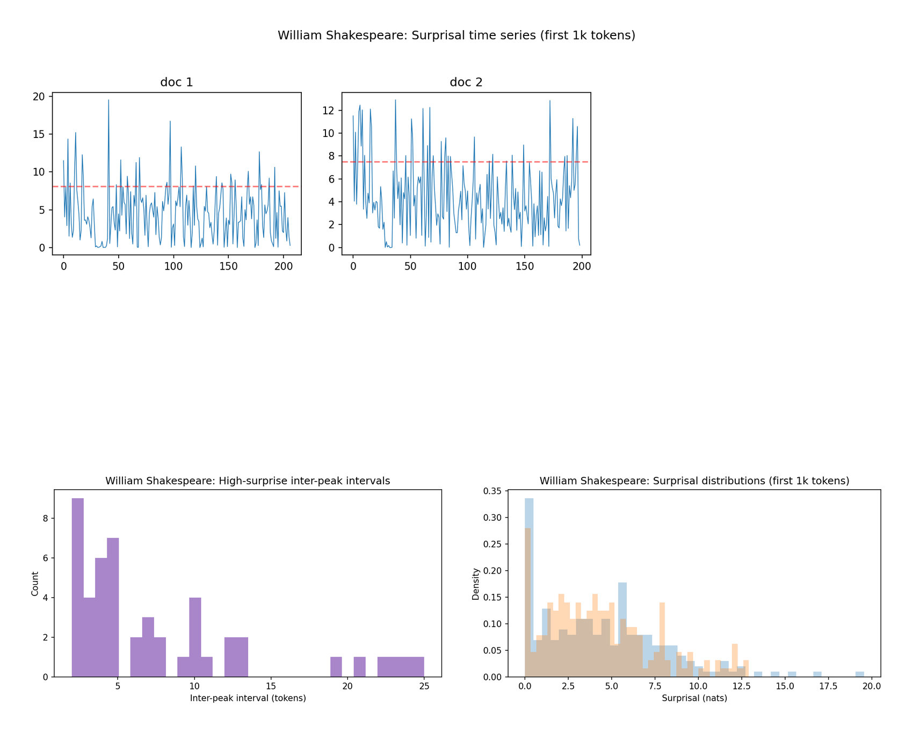
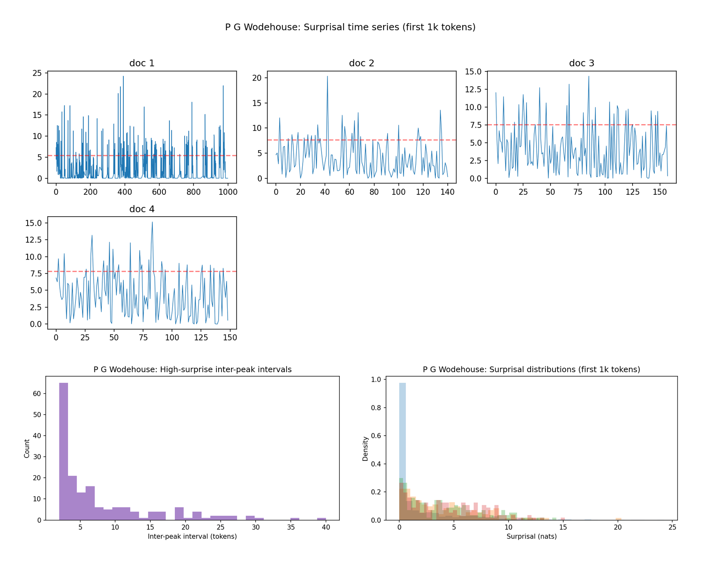
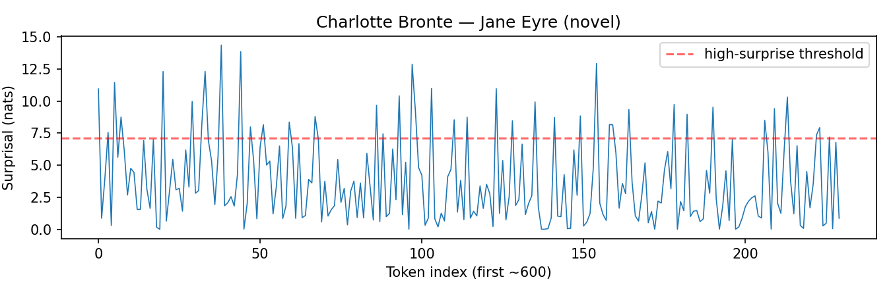
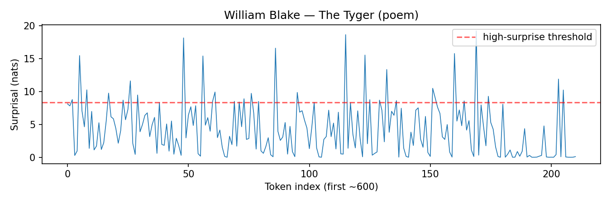
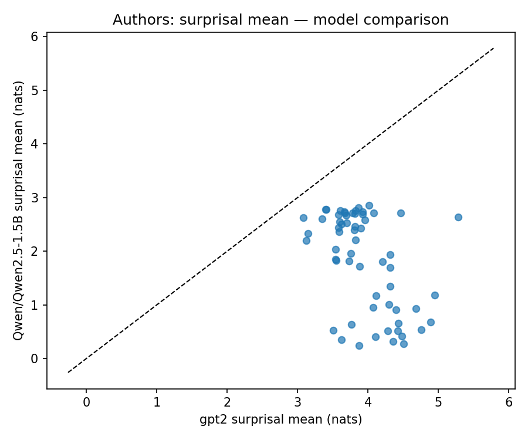
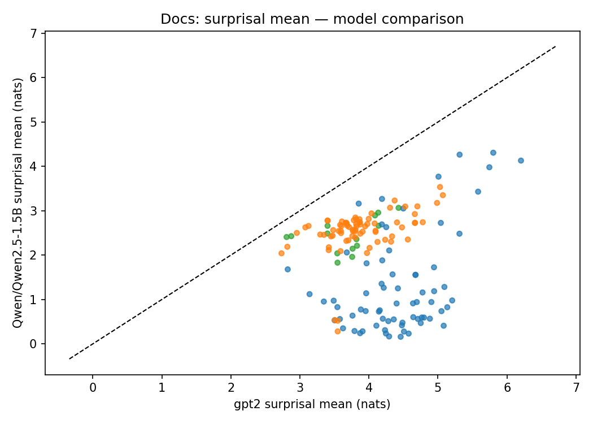
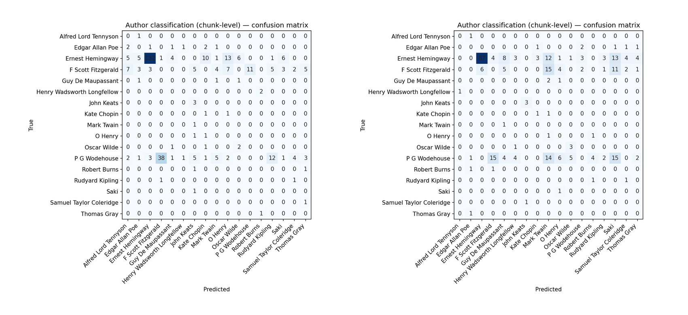

# Measuring Stylistic Signatures and Surprise: GPT‑2 vs Qwen 1.5B

A visual tour through the most interesting slices of our analysis. We highlight patterns at the author level, zoom into individual works, and compare models side‑by‑side. Each figure links back to a concrete computation from the `reports/` outputs.

## Author Highlights

- Cohesion delta: Which authors tighten the most when token order is intact versus shuffled.
- Surprisal: Whose language is most predictable to GPT‑2, on average.
- Joint view: How mean entropy and surprisal co‑vary across authors.

Higher values mean a larger drop in cohesion when the token order is shuffled versus the original text. This highlights styles where word order and local continuity are especially important.

Lower mean surprisal indicates text that GPT‑2 predicts more easily (on average). Treat this as model familiarity, not a quality judgment; some authors mix highly predictable scaffolding with sharp spikes.

A broad positive trend connects mean entropy (uncertainty before the next token) and mean surprisal (observed token “unexpectedness”). Bubble area scales with tokens per author; outliers can mark distinctive cadences or limited data.

## Author Spotlights

Two compact composites per author: top row shows a surprisal time‑series across two documents (first 1k tokens), bottom row shows surprisal and inter‑pause interval (IPI) histograms.

Top: two 1k‑token surprisal traces with dashed means; look for burstiness and plateaus. Bottom: distributional view — surprisal histogram (lexical predictability) and IPI histogram (spacing/rhythm proxy). Together they summarize cadence and variability.

Same layout as above. Compare average levels (dashed lines) and spread of the histograms to see how style differs in predictability and pacing.

## Document Time Series

Representative trajectories by type — novel, poem, and short story.

A compact 2×2 collage of the four examples below.

Novel trajectory: frequent oscillations with moderate spikes — longer‑form narrative often shows layered pacing with recurring local peaks.

Another novel trace for contrast; compare the mean line and spike height/spacing to the prior example.

Poem trajectory: stronger periodicity and sharper spikes reflect concentrated phrasing and rhyme/meter effects.

Short story trajectory: compact arc with distinct high‑surprisal moments at key turns.

## Model Comparison: GPT‑2 vs Qwen 2.5‑1.5B

Author‑ and document‑level mean surprisal scatter plots place each point against the y=x line. Points below the line indicate lower surprisal (greater predictability) for Qwen.

Each point is an author. The dashed y=x line marks parity; points below it indicate lower surprisal (greater predictability) for Qwen relative to GPT‑2.

Same view at the document level. Colors distinguish document types. Clusters well below the parity line indicate broad Qwen gains on those slices.

Distribution of mean surprisal differences per document. The mass sits on the negative side (Qwen − GPT‑2 < 0), indicating lower surprisal for Qwen on most documents.

## Signature Classifier

A quick look at confusion patterns when classifying stylistic signatures across authors for each model.

Interpretation guide: darker diagonal cells mean better author classification; off‑diagonals show confusions between authors. Use the side‑by‑side to compare where each model concentrates errors.

---

### Notes

- Composites are generated with Pillow; source plots live under `reports/` and are copied unmodified into `blogpost/assets/`.
- File names are concise for embed clarity; originals remain available in their original paths.
