# Writing Signatures — Qwen/Qwen2.5-1.5B

## Signatures (Classification)

Directory: signatures_qwen_mlx_full

- Accuracy: 0.31864406779661014

- Documents: 27

- Chunks: 295

- Authors: 17

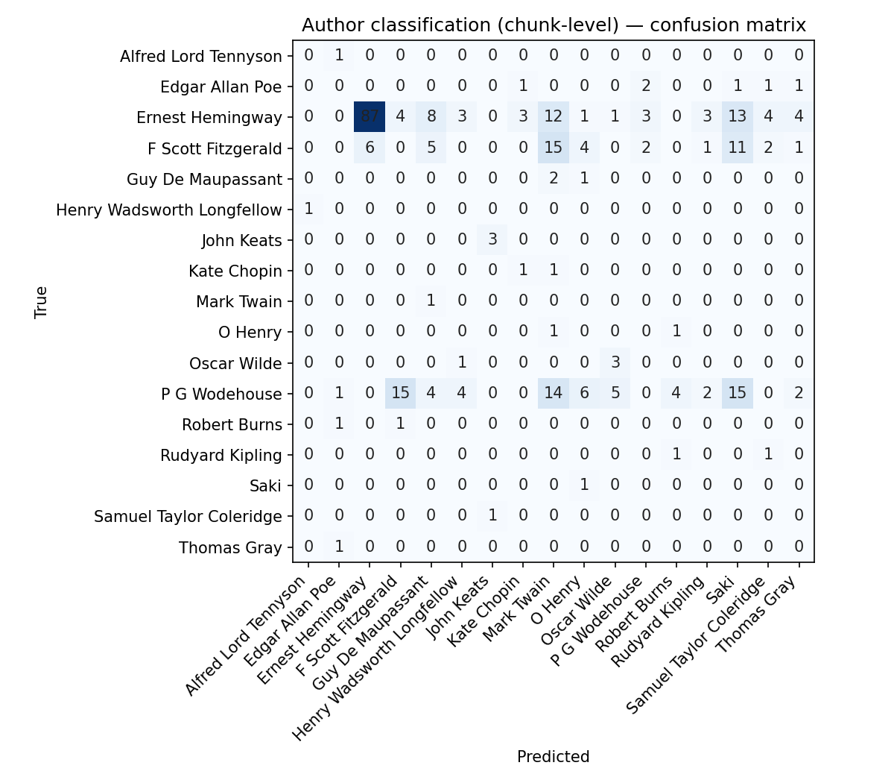

## Authors

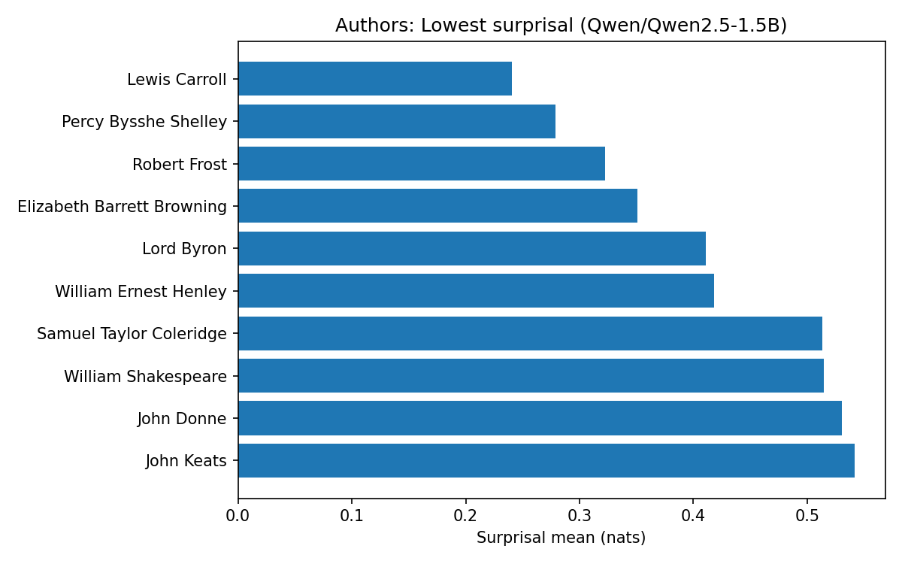

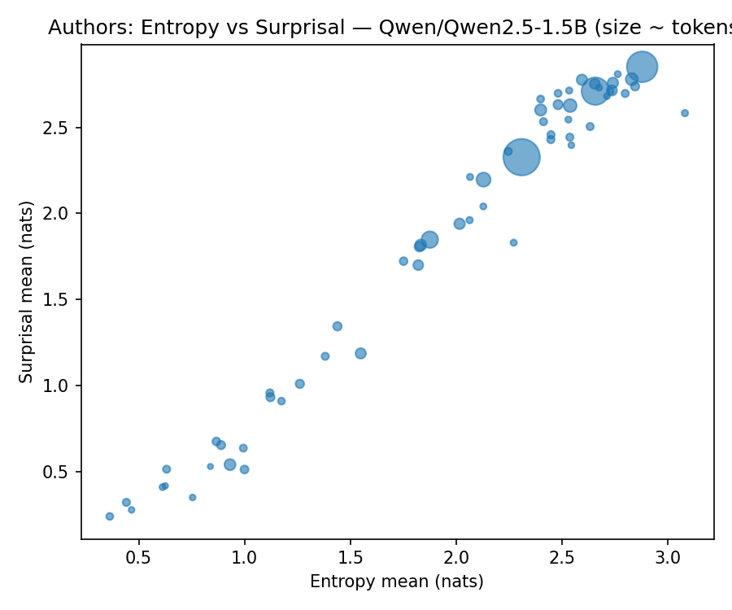

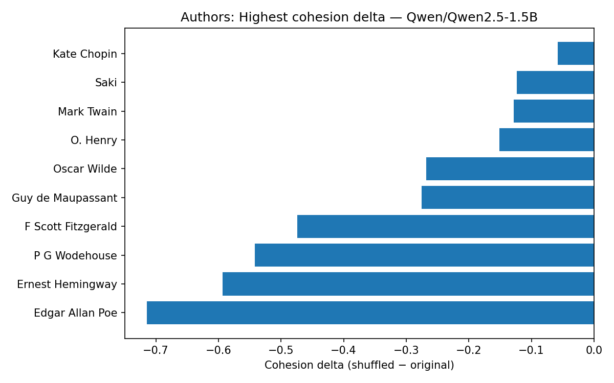

## Documents

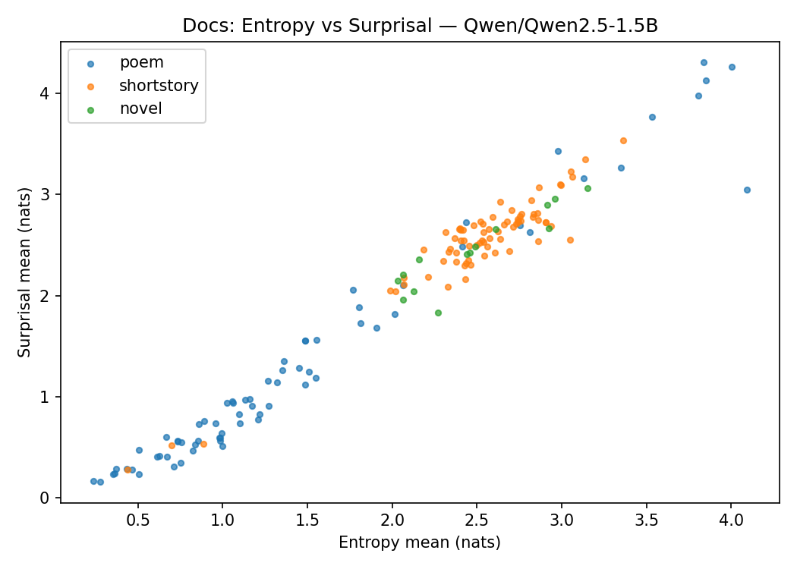

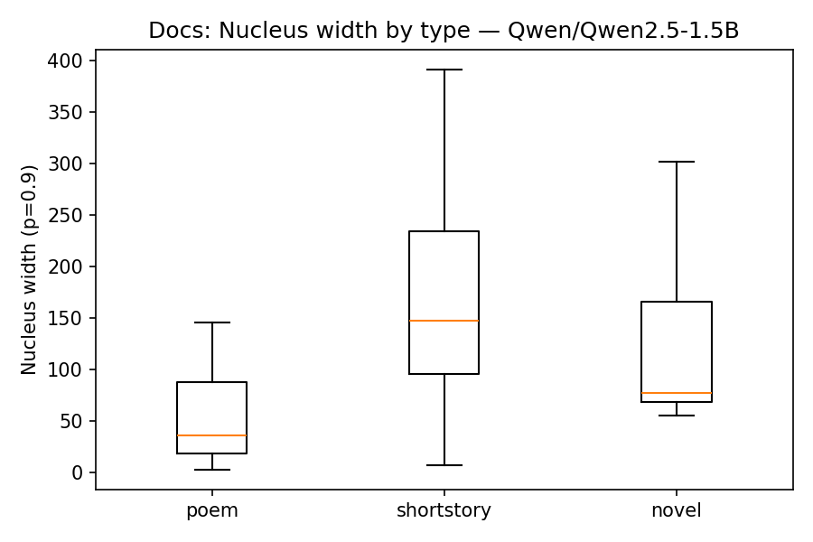

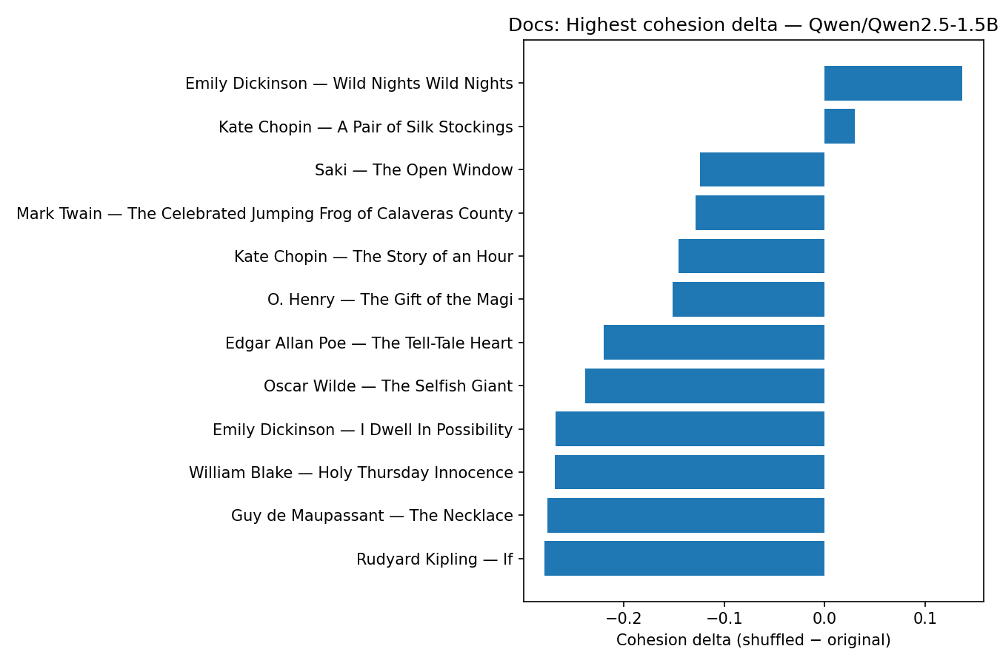

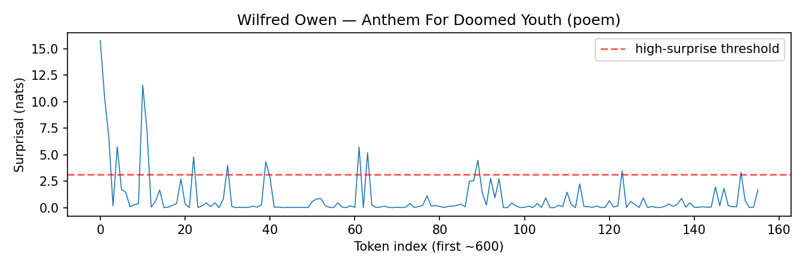

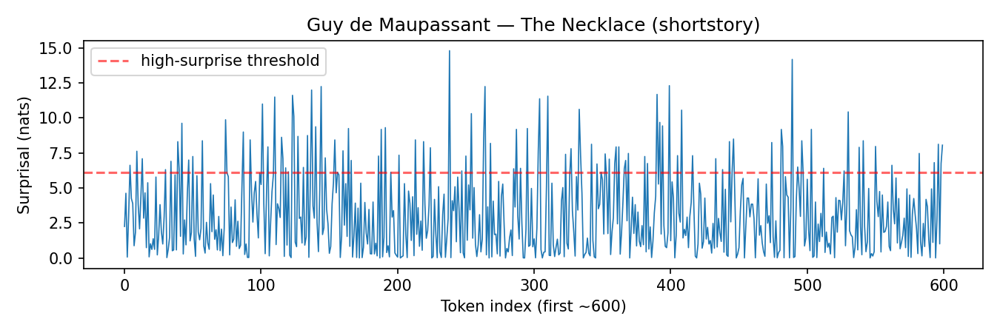

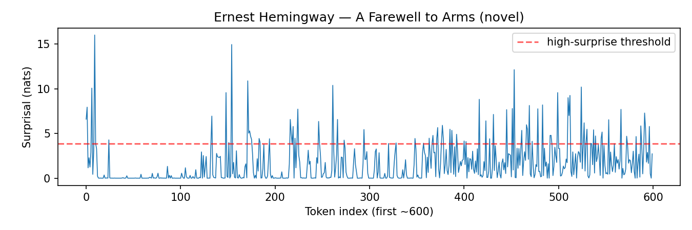

## Author Cadence

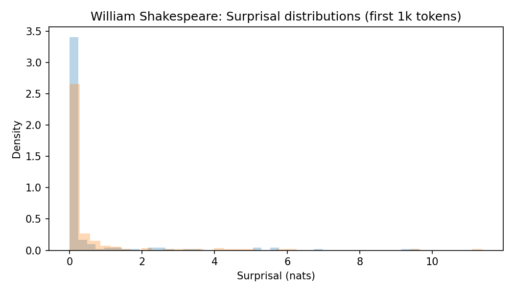

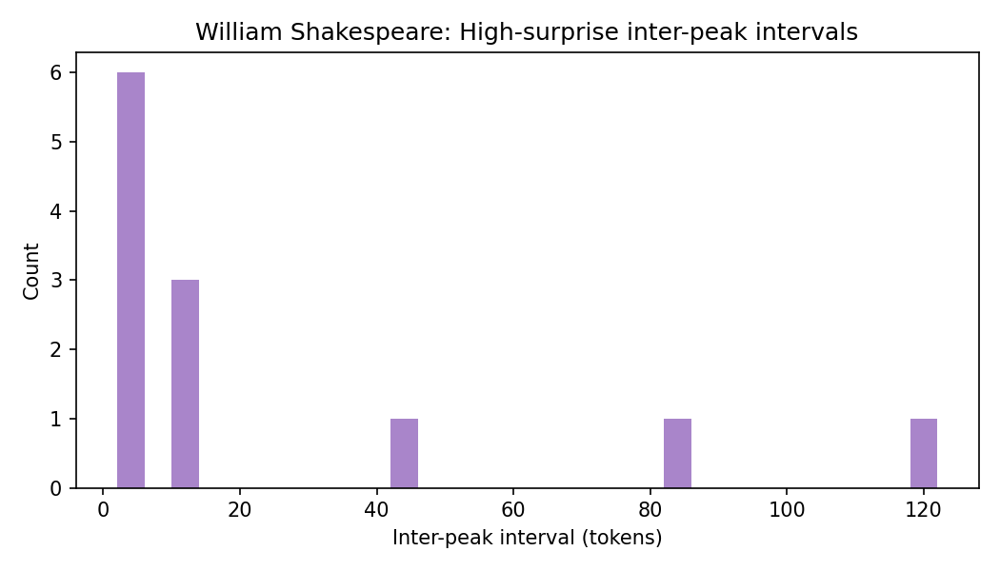

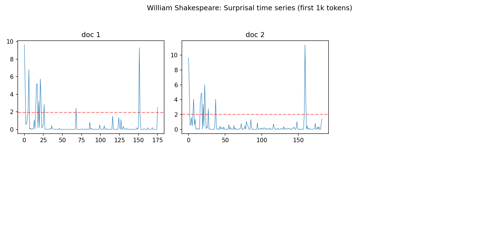

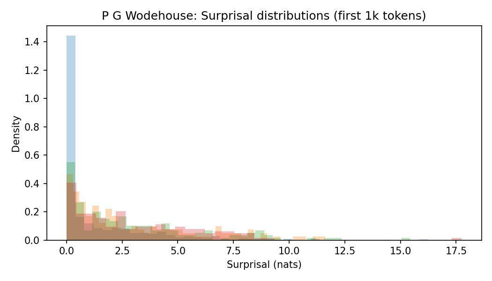

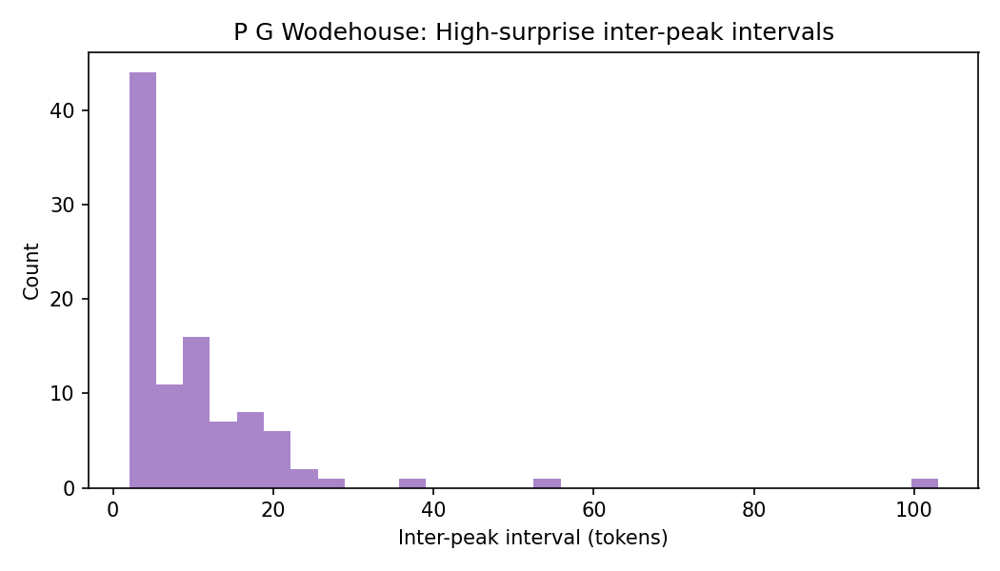

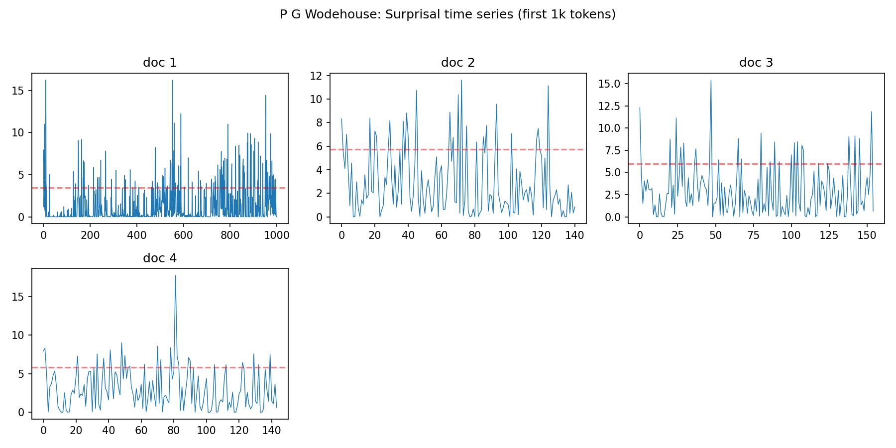

