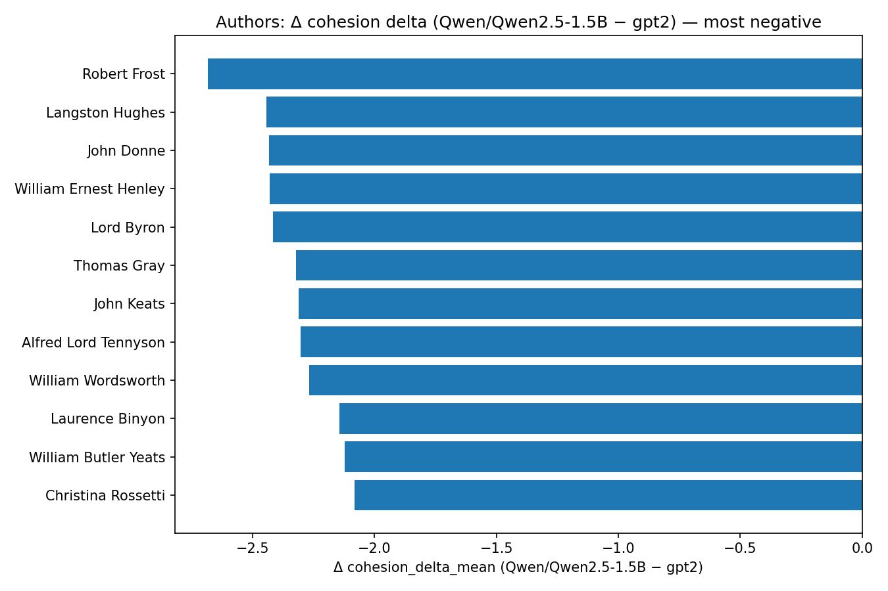
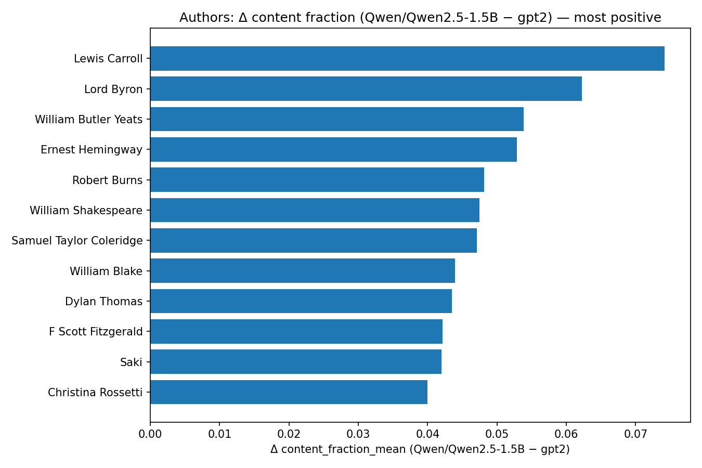
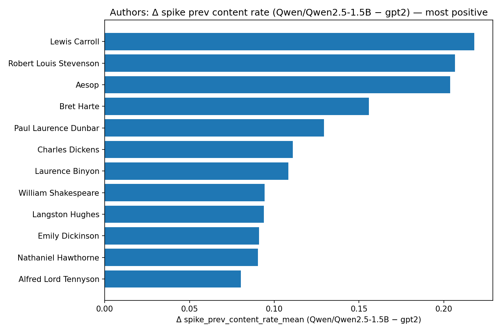
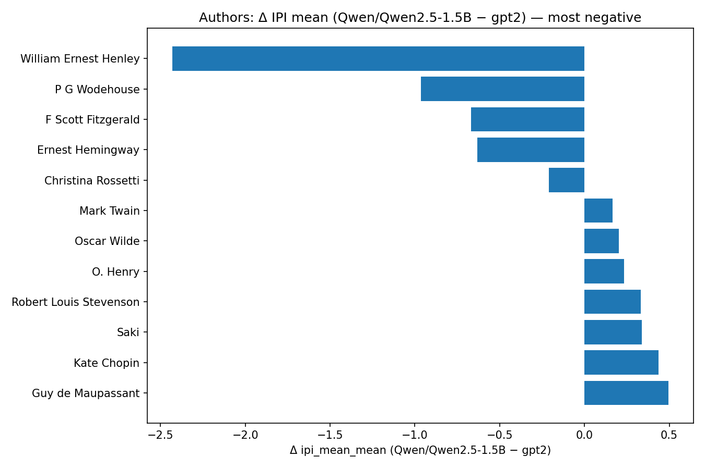
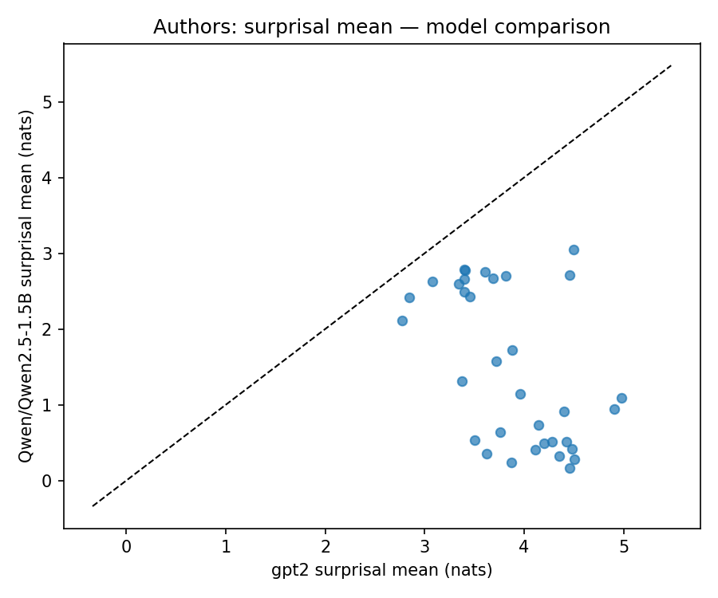
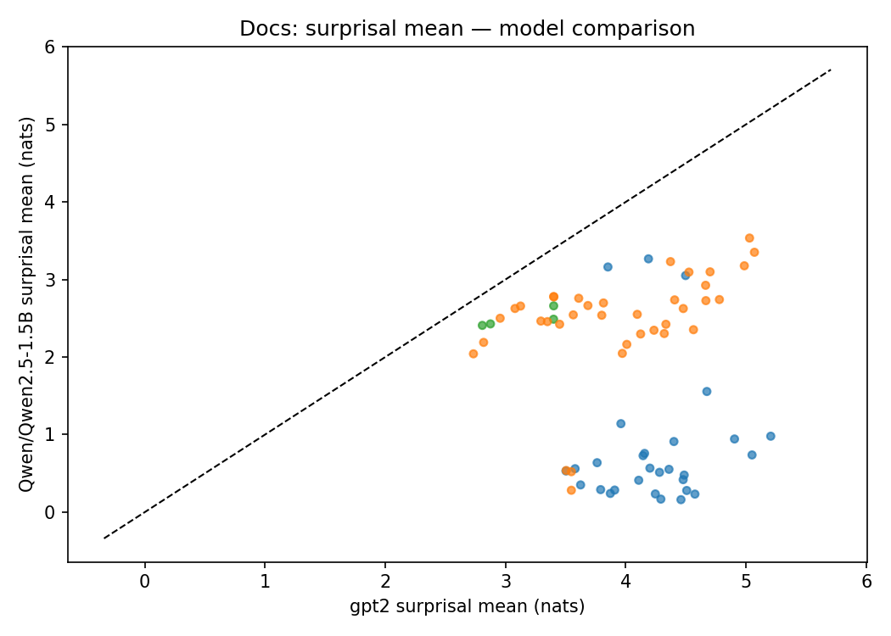
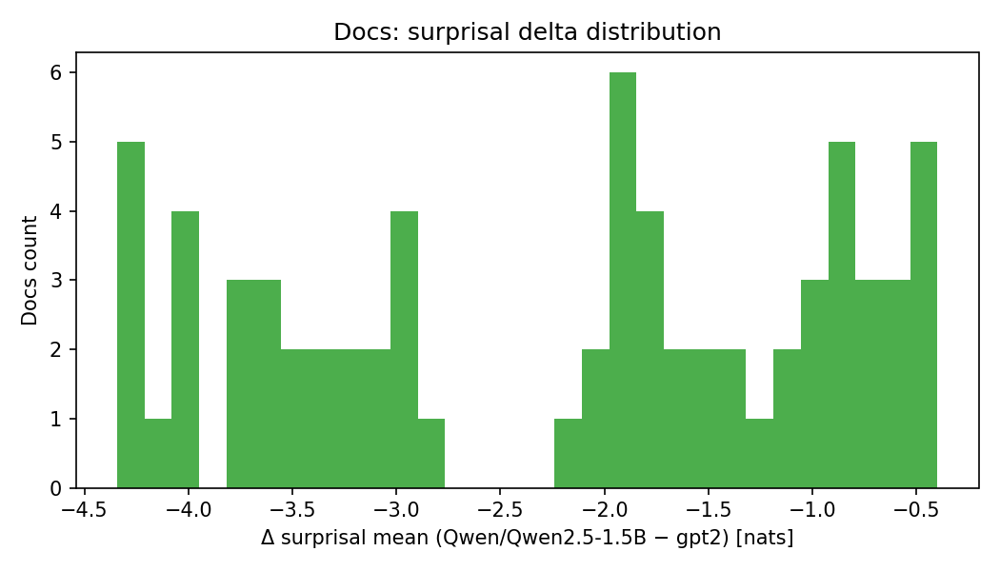
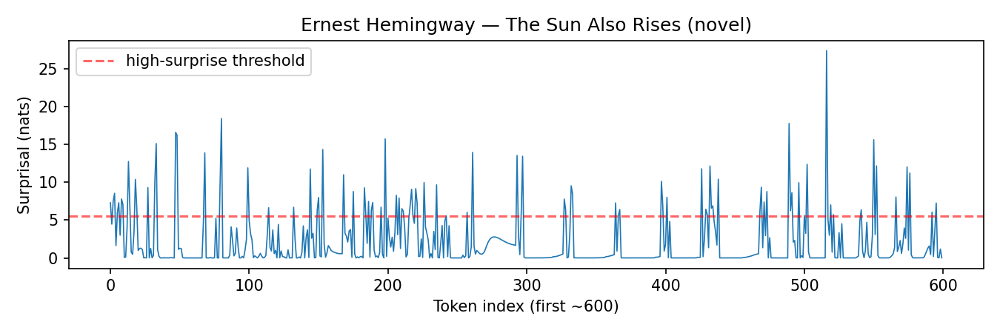
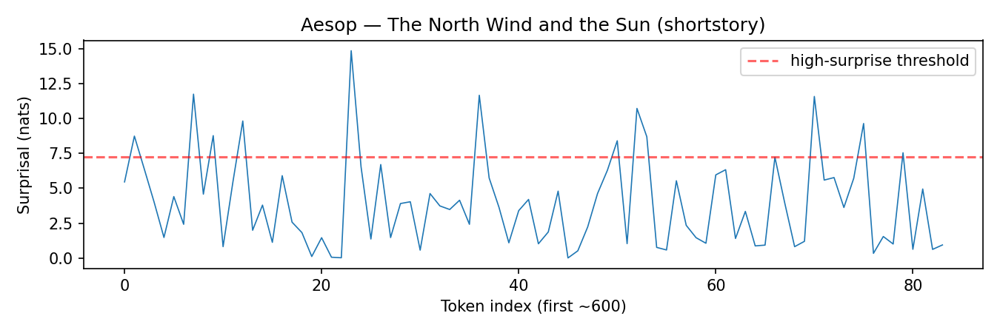

# Combined Writing Signatures — gpt2 vs Qwen/Qwen2.5-1.5B

### Executive Summary

- surprisal mean (nats): mean Δ (Qwen/Qwen2.5-1.5B − gpt2) = -2.383 (lower is better).
- entropy mean (nats): mean Δ (Qwen/Qwen2.5-1.5B − gpt2) = -2.241 (lower is sharper).
- nucleus width (p=0.9): mean Δ (Qwen/Qwen2.5-1.5B − gpt2) = -598.843 (lower is more focused).
- cohesion delta (shuffled − original): mean Δ (Qwen/Qwen2.5-1.5B − gpt2) = -1.326 (more negative means stronger cohesion).
- Largest surprisal drops (Qwen lower than GPT‑2):
  - William Wordsworth: Δ=-4.30  gpt2=4.46 → Qwen/Qwen2.5-1.5B=0.16
  - Percy Bysshe Shelley: Δ=-4.23  gpt2=4.51 → Qwen/Qwen2.5-1.5B=0.28
  - William Ernest Henley: Δ=-4.06  gpt2=4.48 → Qwen/Qwen2.5-1.5B=0.42
  - Robert Frost: Δ=-4.03  gpt2=4.36 → Qwen/Qwen2.5-1.5B=0.32
  - Christina Rossetti: Δ=-3.96  gpt2=4.90 → Qwen/Qwen2.5-1.5B=0.94
  - William Shakespeare: Δ=-3.91  gpt2=4.42 → Qwen/Qwen2.5-1.5B=0.51
  - Emily Dickinson: Δ=-3.89  gpt2=4.98 → Qwen/Qwen2.5-1.5B=1.09
  - Samuel Taylor Coleridge: Δ=-3.77  gpt2=4.28 → Qwen/Qwen2.5-1.5B=0.51

### Per‑Type Deltas (means of Δ = Qwen/Qwen2.5-1.5B − gpt2)

- poem: surprisal -3.41, entropy -2.99, nucleus_w -718, cohesion_delta -2.00
- shortstory: surprisal -1.48, entropy -1.67, nucleus_w -791, cohesion_delta -0.10
- novel: surprisal -0.62, entropy -0.49, nucleus_w -185, cohesion_delta -0.20

### How to Read These Signatures
- Surprisal mean (nats): lower suggests the model finds tokens predictable; poems naturally run higher than prose.
- Entropy mean (nats): lower means sharper distributions (few strong candidates).
- Nucleus width (p=0.9): lower indicates concentrated probability mass; large values signal open‑ended choices.
- Cohesion delta (shuffled − original): more negative ⇒ stronger reliance on order/structure.
- Cadence (IPI, MASD, ACF): captures rhythm — how often spikes occur and how quickly uncertainty settles.
- Token mix (content_fraction, spike context): shows whether surprises align with content words and line boundaries.

For good‑writing signatures: look for structured cadence (stable IPI with occasional spikes),
negative cohesion delta (order matters), focused distributions (smaller nucleus),
and spikes that coincide with contentful turns (high spike_prev/next content rates).

### Findings by Genre and Author

- Poem: Δ surprisal -3.41, Δ entropy -2.99, Δ nucleus_w -718, Δ cohesion_delta -2.00.
- Shortstory: Δ surprisal -1.48, Δ entropy -1.67, Δ nucleus_w -791, Δ cohesion_delta -0.10.
- Novel: Δ surprisal -0.62, Δ entropy -0.49, Δ nucleus_w -185, Δ cohesion_delta -0.20.

- William Shakespeare: Δ surprisal -3.91, Δ entropy -3.67, Δ nucleus_w -804, Δ cohesion_delta -1.38
- Emily Dickinson: Δ surprisal -3.89, Δ entropy -3.01, Δ nucleus_w -883, Δ cohesion_delta -2.50
- Robert Frost: Δ surprisal -4.03, Δ entropy -3.65, Δ nucleus_w -625, Δ cohesion_delta -2.68
- P G Wodehouse: Δ surprisal -0.91, Δ entropy -0.65, Δ nucleus_w -212, Δ cohesion_delta -0.36
- Ernest Hemingway: Δ surprisal -0.42, Δ entropy -0.37, Δ nucleus_w -142, Δ cohesion_delta -0.09
- Edgar Allan Poe: Δ surprisal -2.06, Δ entropy -1.99, Δ nucleus_w -378, Δ cohesion_delta -0.71

#### Synthesis — What ‘good writing’ patterns emerge
- Structure: more negative cohesion delta (shuffling hurts), especially in poetry; Qwen amplifies this.
- Focus: lower entropy and smaller nucleus widths — confident predictions with occasional, meaningful spikes.
- Cadence: inter‑peak intervals are moderate and fairly regular (CV ≈ 0.9–1.1); spikes are followed by entropy cooldown.
- Semantics: spikes align with content tokens; preceding tokens are often function/punctuation, signaling a turn.
- Genre: poems benefit most (largest Δs), short stories next, novels least — consistent with stylistic density.

### Best Practices — Target Bands (from Qwen/Qwen2.5-1.5B)

- Poem:
  - surprisal mean (nats): typical 0.83 (IQR 0.29..0.91)
  - entropy mean (nats): typical 1.04 (IQR 0.50..1.10)
  - nucleus width (p=0.9): typical 72 (IQR 12..67) lower is more focused
  - cohesion delta (shuffled − original): typical -1.93 (IQR -2.32..-1.68) more negative is better
  - spike rate per 100 tokens: typical 5.56 (IQR 3.27..7.41)
  - inter‑peak interval (tokens): typical 13.87 (IQR 8.22..19.00)
  - post‑spike entropy cooldown (3 tokens): typical 1.30 (IQR 1.00..1.60)
  - content token fraction: typical 0.35 (IQR 0.30..0.39)
  - spike prev content rate: typical 0.30 (IQR 0.22..0.38)
  - spike next content rate: typical 0.45 (IQR 0.33..0.56)

- Shortstory:
  - surprisal mean (nats): typical 2.46 (IQR 2.35..2.76)
  - entropy mean (nats): typical 2.45 (IQR 2.34..2.83)
  - nucleus width (p=0.9): typical 199 (IQR 82..297) lower is more focused
  - cohesion delta (shuffled − original): typical -0.24 (IQR -0.30..-0.15) more negative is better
  - spike rate per 100 tokens: typical 12.62 (IQR 12.18..13.90)
  - inter‑peak interval (tokens): typical 6.78 (IQR 5.89..7.00)
  - post‑spike entropy cooldown (3 tokens): typical 1.55 (IQR 1.20..1.79)
  - content token fraction: typical 0.41 (IQR 0.35..0.46)
  - spike prev content rate: typical 0.49 (IQR 0.33..0.62)
  - spike next content rate: typical 0.66 (IQR 0.64..0.75)

- Novel:
  - surprisal mean (nats): typical 2.50 (IQR 2.42..2.53)
  - entropy mean (nats): typical 2.50 (IQR 2.45..2.52)
  - nucleus width (p=0.9): typical 95 (IQR 74..113) lower is more focused
  - cohesion delta (shuffled − original): typical -0.55 (IQR -0.60..-0.46) more negative is better
  - spike rate per 100 tokens: typical 13.03 (IQR 12.89..13.08)
  - inter‑peak interval (tokens): typical 6.55 (IQR 6.52..6.62)
  - post‑spike entropy cooldown (3 tokens): typical 1.23 (IQR 1.10..1.38)
  - content token fraction: typical 0.35 (IQR 0.34..0.35)
  - spike prev content rate: typical 0.30 (IQR 0.29..0.31)
  - spike next content rate: typical 0.63 (IQR 0.59..0.66)

Use these as sanity bands when evaluating generations: aim for focused yet expressive distributions, 
regular but not rigid cadence (IPI around each genre’s typical mean with CV ≈ 1), and negative cohesion deltas.

## Cross‑Model Panels

## Model‑Specific Overviews

### gpt2

### Qwen/Qwen2.5-1.5B

### gpt2: William Shakespeare cadence

### Qwen/Qwen2.5-1.5B: William Shakespeare cadence

### gpt2: P G Wodehouse cadence

### Qwen/Qwen2.5-1.5B: P G Wodehouse cadence

## Full Reports

- [gpt2 full report](../gpt2/README.md)

- [Qwen/Qwen2.5-1.5B full report](../Qwen/Qwen2.5-1.5B/README.md)
