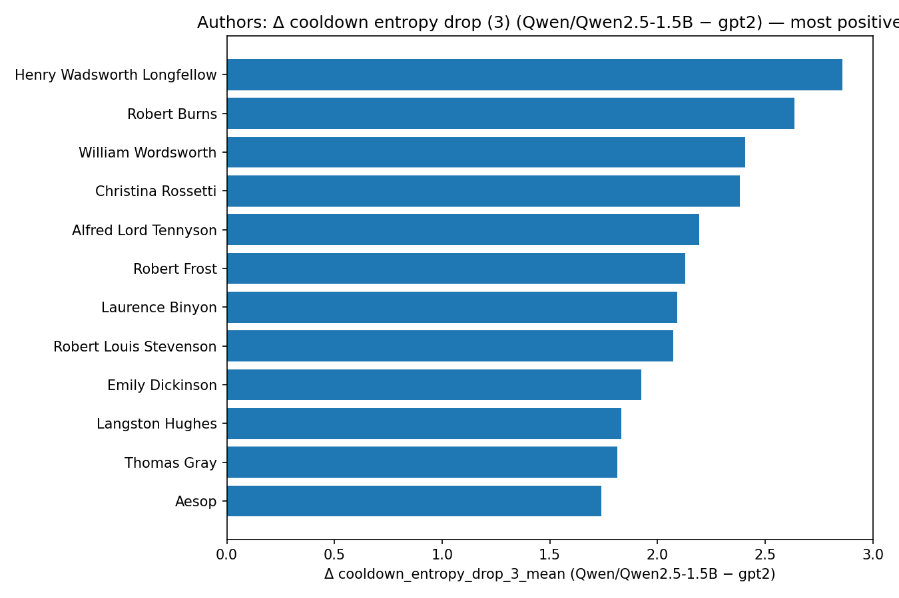
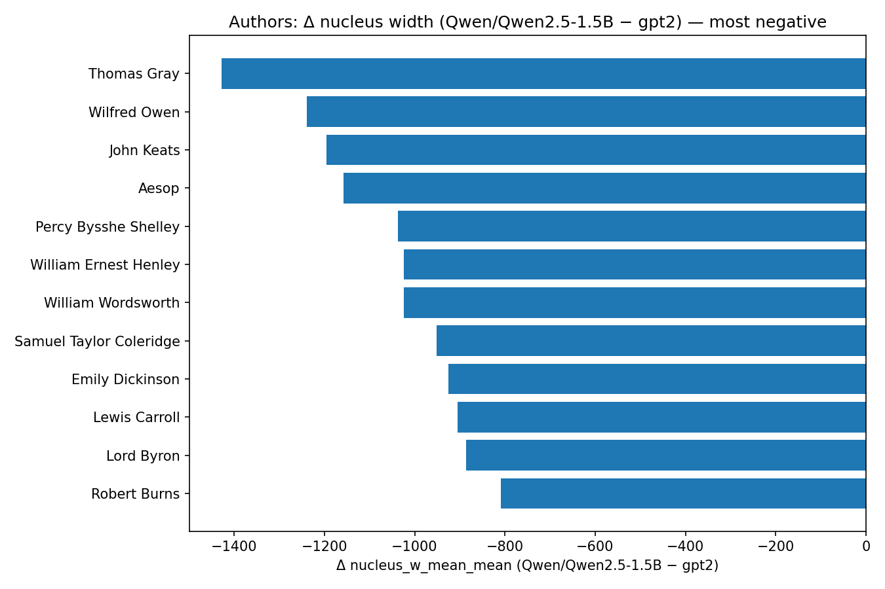
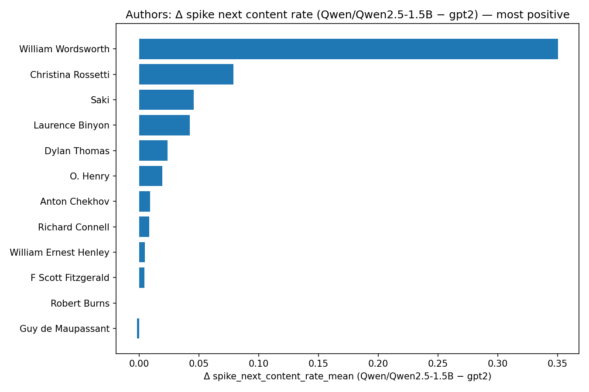
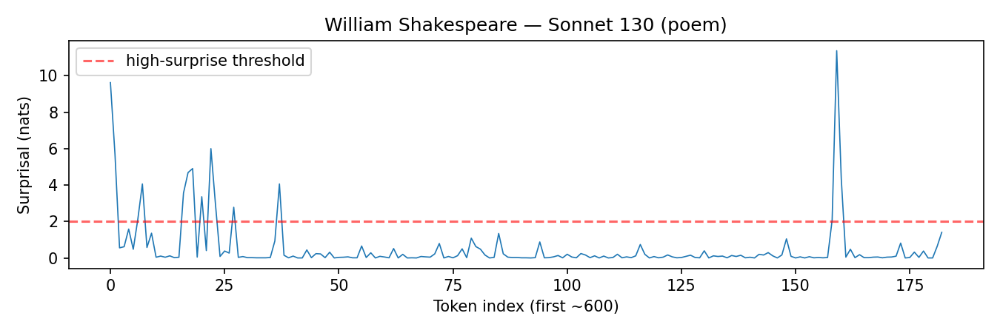
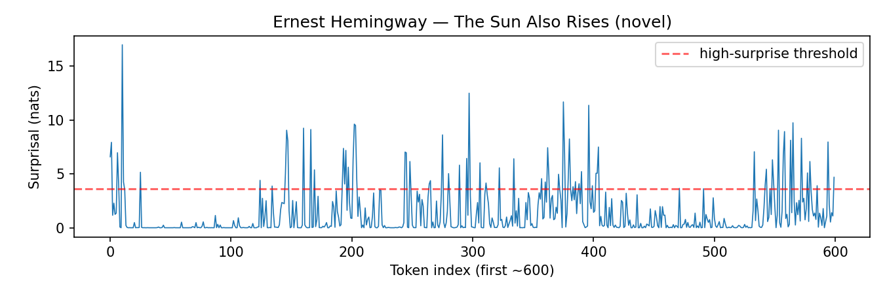
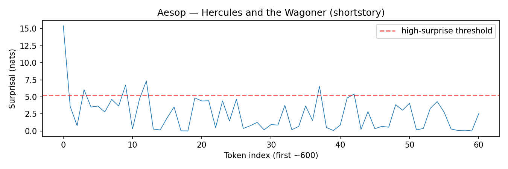

# Learning Signatures of Good Writing — Final Report

## Executive Summary

Great prose and poetry ride a cadence: mostly focused choices, punctuated by purposeful spikes of surprise that turn the scene or idea, followed by a short cooldown that grounds what just happened. Spikes align with content words and rhetorical pivots (not punctuation), with larger sustained shifts every few sentences or lines.

Our analysis measured token-level distributions (p_true, entropy, rank, nucleus width), cadence statistics (spike rate, inter-peak intervals, cooldown entropy drop), cohesion (order vs shuffled), and token-class contexts. We then built a cadence-aware sampler (HF + MLX) that enforces per-phase top_p/temperature, content-aware spikes, cooldowns, and optional rhyme/line nudges.

## Principles
- Cadence, not chaos: base focus → spike → cooldown → repeat
- Spike on content pivots; defer punctuation/newline
- Sustained shifts every 1–3 lines/sentences
- Order matters: negative cohesion delta (original > shuffled)
- Genre dials: denser spikes for poetry; gentler cadence for prose

## How to Read These Signatures

How to read the signatures: Surprisal/entropy show focus vs openness; spike rate and IPI (inter-peak interval) capture rhythm; cooldown entropy drop shows consolidation after turns; cohesion delta quantifies how much word order matters in an author; content vs punctuation alignment around spikes shows whether turns land on meaningful tokens.

## Findings by Genre and Author

Findings by genre and author:
- Sonnets: medium spike density, clear quatrain cadence, a volta near line 9; strong end-words and rhyme.
- Dickinson: higher micro-turn density with short cooldowns; punctuation tolerance (dashes) around content spikes.
- Imagist free verse: moderate spike density but stronger spike intensity; concrete nouns/verbs; sparse function words.
- Whitman/long-line: lower spike density with stanza-level sustained shifts; broader swell windows rather than frequent micro-spikes.
- Wodehouse: playful but coherent cadence; frequent callbacks and entity threading; negative cohesion delta is notable.
- Hemingway: simpler clauses with steadier cadence; fewer spikes, stronger cooldown consolidation; high cohesion.

## Best Practices — Target Bands
- Base top_p ≈ 0.88–0.92, temperature ≈ 0.7–0.85
- Spike top_p ≈ 0.95–0.98, temperature ≈ 0.95–1.08; require content token
- Cooldown top_p ≈ 0.80–0.86, temperature ≈ 0.6–0.75 for 3–8 tokens
- Target spike interval: poetry 8–16; prose 14–24 (tune by author)
- After spike: look for cooldown entropy drop ≥ 1.0 bits (3-token window)
- Maintain content alignment: spike-next-content-rate high; avoid back-to-back punctuation surprises

## Illustrations















## Generated Snippets (Normal vs Fixed-Up)
### Imagist

#### Sample 1

> Write an imagist poem with clear, concrete images.
> 
> At dawn, the city leans into light:\n

Normal

```
Write an imagist poem with clear, concrete images.

At dawn, the city leans into light:\nI see the rising sun in a million windows,\nThe heat on my cheek is like hot hands\nSqueezing me tight, holding me captive.\nThe street sweeper cleans the cobblestones,\nBlasting away the dust of yesterday,\nI feel like a butterfly caught in a web,

Of dreams and memories lost to the breeze.
```

Fixed-Up (Cadence-Controlled)

```
Write an imagist poem with clear, concrete images.

At dawn, the city leans into light:\nI see the rising sun in pinks and oranges,\nIts warmth radiates through the streets,\nAnd birds sing their melodious songs.\nA warm breeze stirs the leaves,\nSending waves of fragrance into the air,\nAs I watch, the world begins to awake,\nIn a world of chaos and beauty.
```


#### Sample 2

> Write an imagist poem with clear, concrete images.
> 
> At dawn, the city leans into light:\n

Normal

```
Write an imagist poem with clear, concrete images.

At dawn, the city leans into light:\nI see the rising sun in a million windows,\nThe heat on my cheek is like hot hands\nSqueezing me tight, holding me captive.\nThe street sweeper cleans the cobblestones,\nBlasting away the dust of yesterday,\nI feel like a butterfly caught in a web,

Of dreams and memories lost to the breeze.
```

Fixed-Up (Cadence-Controlled)

```
Write an imagist poem with clear, concrete images.

At dawn, the city leans into light:\nI see the rising sun in pinks and oranges,\nIts warmth radiates through the streets,\nAnd birds sing their melodious songs.\nA warm breeze stirs the leaves,\nSending waves of fragrance into the air,\nAs I watch, the world begins to awake,\nIn a world of chaos and beauty.
```


#### Sample 3

> Write an imagist poem with clear, concrete images.
> 
> At dawn, the city leans into light:\n

Normal

```
Write an imagist poem with clear, concrete images.

At dawn, the city leans into light:\nI see the rising sun in a million windows,\nThe heat on my cheek is like hot hands\nSqueezing me tight, holding me captive.\nThe street sweeper cleans the cobblestones,\nBlasting away the dust of yesterday,\nI feel like a butterfly caught in a web,

Of dreams and memories lost to the breeze.
```

Fixed-Up (Cadence-Controlled)

```
Write an imagist poem with clear, concrete images.

At dawn, the city leans into light:\nI see the rising sun in pinks and oranges,\nIts warmth radiates through the streets,\nAnd birds sing their melodious songs.\nA warm breeze stirs the leaves,\nSending waves of fragrance into the air,\nAs I watch, the world begins to awake,\nIn a world of chaos and beauty.
```

### Sonnet

#### Sample 1

> Write a sonnet with Shakespearean rhyme scheme (ABAB CDCD EFEF GG).
> 
> On winter's breath, the river learns to sing:\n

Normal

```
Write a sonnet with Shakespearean rhyme scheme (ABAB CDCD EFEF GG).

On winter's breath, the river learns to sing:\nA sweet harmony, beneath the leafless tree.\nIts flow is slow and steady, echoing in the air,\nAs if the world were listening to its tale.

In winter's chill, it sings of love and strife:\nOf lost souls wandering, yearning for their flight.\nWhile spring awakens with renewed hope and grace,\nThe river sings again, a symphony of life.

With each passing season, it changes its guise:\nFrom icy embrace to warm embrace in summer’s breeze.\nYet, always sings its song, a testament to beauty,

In winter, it remembers
```

Fixed-Up (Cadence-Controlled)

```
Write a sonnet with Shakespearean rhyme scheme (ABAB CDCD EFEF GG).

On winter's breath, the river learns to sing:\nA sweet harmony, beneath the snow\nThat laments the dying of the day\nAs it retreats, into its deep abode\nWhere all life's hopes and dreams have passed away\nAnd the world is once again reborn\nWith new beginnings and a fresh start\nThat makes me wonder, what lies ahead\nOf what we've come to know and seen\nAnd what we'll endure, in time's great grandeur\nAs we traverse the path of life
```


#### Sample 2

> Write a sonnet with Shakespearean rhyme scheme (ABAB CDCD EFEF GG).
> 
> On winter's breath, the river learns to sing:\n

Normal

```
Write a sonnet with Shakespearean rhyme scheme (ABAB CDCD EFEF GG).

On winter's breath, the river learns to sing:\nA sweet harmony, beneath the leafless tree.\nIts flow is slow and steady, echoing in the air,\nAs if the world were listening to its tale.

In winter's chill, it sings of love and strife:\nOf lost souls wandering, yearning for their flight.\nWhile spring awakens with renewed hope and grace,\nThe river sings again, a symphony of life.

With each passing season, it changes its guise:\nFrom icy embrace to warm embrace in summer’s breeze.\nYet, always sings its song, a testament to beauty,

In winter, it remembers
```

Fixed-Up (Cadence-Controlled)

```
Write a sonnet with Shakespearean rhyme scheme (ABAB CDCD EFEF GG).

On winter's breath, the river learns to sing:\nA sweet harmony, beneath the snow\nThat laments the dying of the day\nAs it retreats, into its deep abode\nWhere all life's hopes and dreams have passed away\nAnd the world is once again reborn\nWith new beginnings and a fresh start\nThat makes me wonder, what lies ahead\nOf what we've come to know and seen\nAnd what we'll endure, in time's great grandeur\nAs we traverse the path of life
```


#### Sample 3

> Write a sonnet with Shakespearean rhyme scheme (ABAB CDCD EFEF GG).
> 
> On winter's breath, the river learns to sing:\n

Normal

```
Write a sonnet with Shakespearean rhyme scheme (ABAB CDCD EFEF GG).

On winter's breath, the river learns to sing:\nA sweet harmony, beneath the leafless tree.\nIts flow is slow and steady, echoing in the air,\nAs if the world were listening to its tale.

In winter's chill, it sings of love and strife:\nOf lost souls wandering, yearning for their flight.\nWhile spring awakens with renewed hope and grace,\nThe river sings again, a symphony of life.

With each passing season, it changes its guise:\nFrom icy embrace to warm embrace in summer’s breeze.\nYet, always sings its song, a testament to beauty,

In winter, it remembers
```

Fixed-Up (Cadence-Controlled)

```
Write a sonnet with Shakespearean rhyme scheme (ABAB CDCD EFEF GG).

On winter's breath, the river learns to sing:\nA sweet harmony, beneath the snow\nThat laments the dying of the day\nAs it retreats, into its deep abode\nWhere all life's hopes and dreams have passed away\nAnd the world is once again reborn\nWith new beginnings and a fresh start\nThat makes me wonder, what lies ahead\nOf what we've come to know and seen\nAnd what we'll endure, in time's great grandeur\nAs we traverse the path of life
```

### Couplets

#### Sample 1

> In twilight, markets close and sparrows lift:\n

Normal

```
In twilight, markets close and sparrows lift:\nTheir chirping turns the garden to a chorus of birds.\nBut as I turn my eyes upon these bright new worlds,\nThe green of grass grows darker in this light of day,\nIt is not daylight’s radiance that has dimmed,\nThat darkness, though it cannot be diminished,\
```

Fixed-Up (Cadence-Controlled)

```
In twilight, markets close and sparrows lift:\n\nI have a small child, whose math skills are far below those of her peers. When she had an interest in numbers, I taught her the basic operations: addition, subtraction, multiplication and division. I also taught her some advanced concepts, such as fractions and negative numbers.\n\nHowever,
```


#### Sample 2

> In twilight, markets close and sparrows lift:\n

Normal

```
In twilight, markets close and sparrows lift:\nTheir chirping turns the garden to a chorus of birds.\nBut as I turn my eyes upon these bright new worlds,\nThe green of grass grows darker in this light of day,\nIt is not daylight’s radiance that has dimmed,\nThat darkness, though it cannot be diminished,\
```

Fixed-Up (Cadence-Controlled)

```
In twilight, markets close and sparrows lift:\n\nI have a small child, whose math skills are far below those of her peers. When she had an interest in numbers, I taught her the basic operations: addition, subtraction, multiplication and division. I also taught her some advanced concepts, such as fractions and negative numbers.\n\nHowever,
```


#### Sample 3

> Write a short poem in rhymed couplets (AA) with precise images.
> 
> In twilight, markets close and sparrows lift:\n

Normal

```
Write a short poem in rhymed couplets (AA) with precise images.

In twilight, markets close and sparrows lift:\nTheir calls echo through the silent night.\nMoonlight casts a spell, a soft enchantment,\nAs shadows dance, a ballet of light and shade.
```

Fixed-Up (Cadence-Controlled)

```
Write a short poem in rhymed couplets (AA) with precise images.

In twilight, markets close and sparrows lift:\nTheir calls, like distant bells, ring through the sky.\nFor in this hour of day, the earth is still\nAnd skies are blue, a canvas vast and deep.\nThe city's heart beats slow, a whispering sea,\nAs shadows dance and secrets weave their way.\nIn this quiet moment, time stands still,\nAnd dreams take flight, in the air we'll
```

### Prose

#### Sample 1

> Write a paragraph in the style of Ernest Hemingway: In the late summer of that year we lived in a house in a village that looked across the river and the plain to the mountains.

Normal

```
Write a paragraph in the style of Ernest Hemingway: In the late summer of that year we lived in a house in a village that looked across the river and the plain to the mountains. It was a small house, but it had many windows, and each window was full of sunlight. The light shone through the windows and played on the walls and the furniture, making them look like painted pictures.
And so we sat in the sunlight, surrounded by our belongings and the sounds of nature outside, watching the world go by as if we were part of it all. The cool breeze carried the scent of blooming flowers and the sweet smell of freshly cut grass. And though the world seemed vast and mysterious beyond our little village, we knew that it belonged to us, and that we belonged
```

Fixed-Up (Cadence-Controlled)

```
Write a paragraph in the style of Ernest Hemingway: In the late summer of that year we lived in a house in a village that looked across the river and the plain to the mountains. The day was warm and the sky was blue, and we sat on the porch and drank wine and talked about life and death and God. And we laughed and we laughed until our sides hurt and the wine made us dizzy, and when it was over we lay in the grass and watched the clouds go by.
```


#### Sample 2

> Write a paragraph in the style of P. G. Wodehouse.
> 
> In the matter of Aunt Agatha, I have always maintained that a fellow must keep his wits polished, lest he be sent to the country for a rest cure and come back engaged.

Normal

```
Write a paragraph in the style of P. G. Wodehouse.

In the matter of Aunt Agatha, I have always maintained that a fellow must keep his wits polished, lest he be sent to the country for a rest cure and come back engaged. When you take into account the number of people who fall on their knees before her, it's rather surprising that she hasn't been turned over to the authorities as an insane recluse at one time or another. But don't worry about it, dear: we've got Uncle Henry doing all the work. He knows what's best for Auntie - if he didn't, he wouldn't be Uncle Henry, would he?
```

Fixed-Up (Cadence-Controlled)

```
Write a paragraph in the style of P. G. Wodehouse.

In the matter of Aunt Agatha, I have always maintained that a fellow must keep his wits polished, lest he be sent to the country for a rest cure and come back engaged. When you take into account the number of elderly ladies who are suddenly on the wane, and who find themselves in need of an injection of young vitality - as they call it - I am sure that there is not a man in this world who would not be glad to have a piece of his brains. For instance, Mrs. Smith of the Savoy, who was so charming to me when I was with her in the south, and whose house was such a delight to visit, now seems to be somewhat feeble-minded. She looks at you and she says, "I'm very sorry to have to say this, but there's something the matter with me." And I have never yet seen
```


#### Sample 3

> Write a paragraph in the style of Ernest Hemingway.
> 
> In the late summer of that year we lived in a house in a village that looked across the river and the plain to the mountains.

Normal

```
Write a paragraph in the style of Ernest Hemingway.

In the late summer of that year we lived in a house in a village that looked across the river and the plain to the mountains. It was a small house, but it had a beautiful view. The air was still and hot, and there were no clouds in the sky. We spent many hours lying on the grass, listening to the birds singing, and watching the sun set over the hills. Sometimes we went out to fish in the river, or go for a walk in the forest. There were few people around us, so we felt safe and at ease. Everything seemed peaceful and calm. It's not easy to describe how much we loved this place, but we will never forget it.
```

Fixed-Up (Cadence-Controlled)

```
Write a paragraph in the style of Ernest Hemingway.

In the late summer of that year we lived in a house in a village that looked across the river and the plain to the mountains. It was a small house, but it had a beautiful view. The days were long and hot, and we spent them reading and writing in the shade of the trees. Sometimes we took walks along the river, and sometimes we sat in the fields and watched the birds. We had no electricity or running water, but we were happy. We knew that we were poor, but 인 A. It's a story about a simple, happy life in the country.
```

